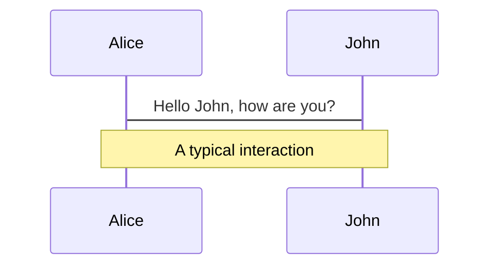
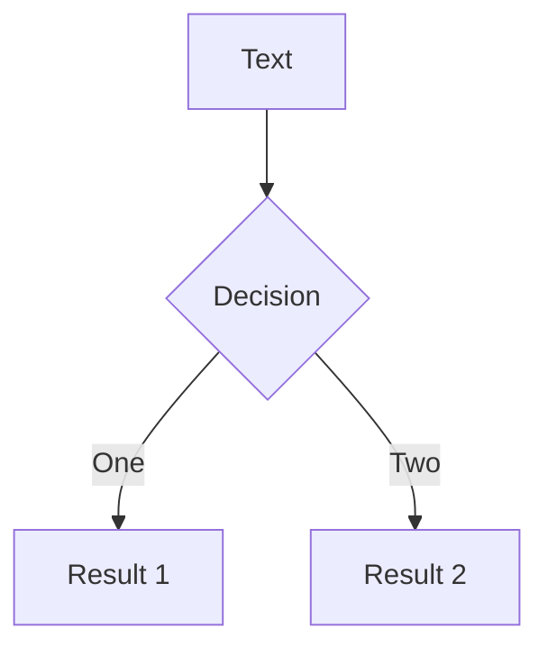
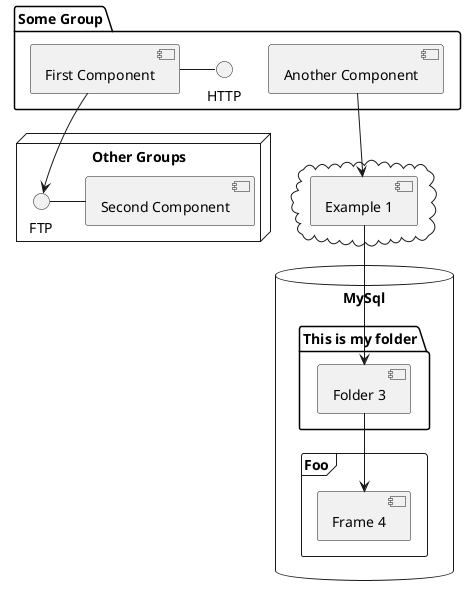

---
# try also 'default' to start simple
theme: seriph
# random image from a curated Unsplash collection by Anthony
# like them? see https://unsplash.com/collections/94734566/slidev
background: "/img/bg.jpg"
# apply any windi css classes to the current slide
class: 'text-center'
# https://sli.dev/custom/highlighters.html
highlighter: shiki
# show line numbers in code blocks
lineNumbers: false
# some information about the slides, markdown enabled
info: |
  ## Slidev Starter Template
  Presentation slides for developers.

  Learn more at [Sli.dev](https://sli.dev)
# persist drawings in exports and build
drawings:
  persist: false
---
<div class="text-gray-200 mb-12">

# 程序员如何开始做一个
# Side Project？

</div>

<div class="text-blue-300">

### ——以  “[我的人人](http://localhost:3000/)”  为例

</div>

<div class="pt-20 text-gray-300 text-right">研发中心-工程二组 (火星)</div>
<div class="pt-4 text-gray-300 text-right pr-18">何一鸣</div>

<!--
The last comment block of each slide will be treated as slide notes. It will be visible and editable in Presenter Mode along with the slide. [Read more in the docs](https://sli.dev/guide/syntax.html#notes)
-->

---
layout: image
image: "/img/bg1.jpg"
---

<div class="flex mb-6">
  <div class="flex-1 mr-6 rounded-lg p-4 bg-gray-50 bg-opacity-20">
    <div v-click class="text-2xl title font-bold mb-2">什么是 Side Project</div>
    <div v-click class="leading-6 text-sm text-gray-200">Side Project 中文翻译：<br/>副项目、小项目、副业等。<br/>区别于主项目，是自己在闲暇时间开发的产品。</div>
  </div>
  <div class="flex-1 rounded-lg p-4 bg-gray-50 bg-opacity-20">
    <div v-click class="text-2xl title font-bold mb-2">Side Project 的意义</div>
    <ul class="text-sm text-gray-200">
      <li v-click>解决自己或别人的问题</li>
      <li v-click>练手，提高技术</li>
      <li v-click>赚钱</li>
      <li v-click>Just For Fun</li>
    </ul>
  </div>
</div>
<div class="rounded-lg p-4 bg-gray-50 bg-opacity-20 h-70">
<div v-click class="text-2xl title font-bold mb-2">举几个栗子</div>
<v-clicks>

- Vue
- 简书
- [雪球神器](https://github.com/ymjrcc/xueqiu_crx)
- 直播/自媒体
- 三体

</v-clicks>
</div>

<style>
.title {
  background-color: #2B90B6;
  background-image: linear-gradient(45deg, #4EC5D4 10%, #146b8c 20%);
  background-size: 100%;
  -webkit-background-clip: text;
  -moz-background-clip: text;
  -webkit-text-fill-color: transparent;
  -moz-text-fill-color: transparent;
}
</style>

---
layout: image
image: "/img/bg2.jpg"
---

<v-click>

# 开始前问自己几个问题：

</v-click>

<br/>

<div class="rounded-lg p-6 bg-gray-50 bg-opacity-20">
<v-clicks>

- ❓ **What** - 我的产品是什么，产品需求边界在哪里?（要做什么，不做什么）
- ❓ **Why** - 我为什么要做它，它能解决当下的什么问题，或对我有什么意义？
- ❓ **How** - 我打算如何实现它？（用什么技术，花多长时间，做到什么程度）

</v-clicks>
</div>

<br/>
<br/>

<h1 v-click>我工作太忙，没有时间做怎么办？</h1>
<br/>
<div class="rounded-lg p-6 bg-gray-50 bg-opacity-20">
  <h2 v-click class="text-green-500 italic mb-4">不，你有！</h2>
  <div class="text-gray-300 text-sm italic" v-click>✅ 需求驱动 ✅ 兴趣驱动 ✅ 善用零碎时间</div>
</div>

<!--
You can have `style` tag in markdown to override the style for the current page.
Learn more: https://sli.dev/guide/syntax#embedded-styles
-->

<style>
h1 {
  background-color: #2B90B6;
  background-image: linear-gradient(45deg, #4EC5D4 10%, #146b8c 20%);
  background-size: 100%;
  -webkit-background-clip: text;
  -moz-background-clip: text;
  -webkit-text-fill-color: transparent;
  -moz-text-fill-color: transparent;
}
</style>


---
layout: image
image: "/img/bg3.jpg"
---

# 需求清单和项目里程碑

<div class="rounded-lg p-3 bg-gray-50 bg-opacity-20">
  <div>
    <span class="text-blue-300">分类拆解：</span>
    <span v-click class="text-base">将整个工程分门别类，然后细化成一个个小任务，巧用 TODO，做一个勾一个</span>
  </div>
  <div>
    <span class="text-blue-300">需求迭代：</span>
    <span v-click class="text-base">做好规划，想好再改</span>
  </div>
</div>

<br/>
<div class="flex justify-around">
  
  
  
</div>

<style>
h1 {
  background-color: #2B90B6;
  background-image: linear-gradient(45deg, #4EC5D4 10%, #146b8c 20%);
  background-size: 100%;
  -webkit-background-clip: text;
  -moz-background-clip: text;
  -webkit-text-fill-color: transparent;
  -moz-text-fill-color: transparent;
}
</style>

---
layout: image
image: "/img/bg4.jpg"
---
# Coding 准备

<div class="rounded-lg p-3 bg-gray-50 bg-opacity-20 mt-8">
<div v-click class="text-xl text-blue-300 mb-2">工欲善其事，必先利其器：准备合适的工具</div>
<div class="ml-6">
<v-clicks>

- 代码托管：GitHub Private Repository
- 编辑器：VS Code + 项目管理器插件
- 需求与进度管理、笔记记录：Logseq
- ……

</v-clicks>
</div>
</div>

<div class="rounded-lg p-3 bg-gray-50 bg-opacity-20 mt-8">
<div v-click class="text-xl text-blue-300 mb-2">怎么舒服怎么来：选择最适合自己的技术栈</div>
<div class="ml-6">
<v-clicks>

- React （create-react-app）
- Ant Design
- echarts
- ……

</v-clicks>
</div>
</div>


<style>
h1 {
  background-color: #2B90B6;
  background-image: linear-gradient(45deg, #4EC5D4 10%, #146b8c 20%);
  background-size: 100%;
  -webkit-background-clip: text;
  -moz-background-clip: text;
  -webkit-text-fill-color: transparent;
  -moz-text-fill-color: transparent;
}
</style>

---
layout: image
image: "/img/bg4.jpg"
---
# Coding 原则

<div class="rounded-lg p-3 bg-gray-50 bg-opacity-20 mt-6">
<div v-click class="text-xl text-blue-300 mb-2">不怕折腾，放心大胆地尝试最新的技术</div>
<div class="ml-6">
<v-clicks>

- TailWind CSS → Windi CSS
- React 17 → React 18

</v-clicks>
</div>
</div>

<div class="rounded-lg p-3 bg-gray-50 bg-opacity-20 mt-6">
<div v-click class="text-xl text-blue-300 mb-2">要代码质量，不要天马行空</div>
<div class="ml-6">
<v-clicks>

- [React.StrickMode](https://zhuanlan.zhihu.com/p/401329405)
- TypeScript + ts-standard

</v-clicks>
</div>
</div>

<div class="rounded-lg p-3 bg-gray-50 bg-opacity-20 mt-6">
<div v-click class="text-xl text-blue-300 mb-2">DRY</div>
<div class="ml-6">
<v-clicks>

- 函数复用、组件模块抽取
- 代码优化和重构

</v-clicks>
</div>
</div>


<style>
h1 {
  background-color: #2B90B6;
  background-image: linear-gradient(45deg, #4EC5D4 10%, #146b8c 20%);
  background-size: 100%;
  -webkit-background-clip: text;
  -moz-background-clip: text;
  -webkit-text-fill-color: transparent;
  -moz-text-fill-color: transparent;
}
</style>

---
layout: image
image: "/img/bg4.jpg"
---
# Coding 心得

<div class="rounded-lg p-3 bg-gray-50 bg-opacity-20 mt-4">
<div v-click class="text-xl text-blue-300 mb-2">一边写代码，一边做笔记，做好知识沉淀</div>
<div class="ml-6">
<v-clicks>

- 代码片段（简陋版 dayjs）
- 工具技巧（VS Code 正则搜索替换）

</v-clicks>
</div>
</div>

<div class="rounded-lg p-3 bg-gray-50 bg-opacity-20 mt-4">
<div v-click class="text-xl text-blue-300 mb-2">善用但克制使用第三方库</div>
<div class="ml-6">
<v-clicks>

- 杜绝层层封装（echarts-for-react）
- 不要为了一个小功能引入一个大依赖（dayjs）

</v-clicks>
</div>
</div>

<div class="rounded-lg p-3 bg-gray-50 bg-opacity-20 mt-4">
<div v-click class="text-xl text-blue-300 mb-2">拥抱社区和开源</div>
<div class="ml-6">
<v-clicks>

- 加社群答疑，向社区反馈使用中的 bug 和问题（提问的艺术）
- 有能力的话提 pr，反哺社区
- 考虑开源自己的作品

</v-clicks>
</div>
</div>


<style>
h1 {
  background-color: #2B90B6;
  background-image: linear-gradient(45deg, #4EC5D4 10%, #146b8c 20%);
  background-size: 100%;
  -webkit-background-clip: text;
  -moz-background-clip: text;
  -webkit-text-fill-color: transparent;
  -moz-text-fill-color: transparent;
}
</style>

---
layout: image
image: "/img/bg4.jpg"
---

# Coding

Use code snippets and get the highlighting directly![^1]
<div class="flex">
<div class="flex-1">
asdfasdfasdfasdfasfasd
</div>
<div class="flex-1">

```ts {all|2|1-6|9|all}
interface User {
  id: number
  firstName: string
  lastName: string
  role: string
}

function updateUser(id: number, update: User) {
  const user = getUser(id)
  const newUser = { ...user, ...update }
  saveUser(id, newUser)
}
```

</div>
</div>

<style>
h1 {
  background-color: #2B90B6;
  background-image: linear-gradient(45deg, #4EC5D4 10%, #146b8c 20%);
  background-size: 100%;
  -webkit-background-clip: text;
  -moz-background-clip: text;
  -webkit-text-fill-color: transparent;
  -moz-text-fill-color: transparent;
}
</style>

---

# Components

<div grid="~ cols-2 gap-4">
<div>

You can use Vue components directly inside your slides.

We have provided a few built-in components like `<Tweet/>` and `<Youtube/>` that you can use directly. And adding your custom components is also super easy.

```html
<Counter :count="10" />
```

<!-- ./components/Counter.vue -->
<Counter :count="10" m="t-4" />

Check out [the guides](https://sli.dev/builtin/components.html) for more.

</div>
<div>

```html
<Tweet id="1390115482657726468" />
```

<Tweet id="1390115482657726468" scale="0.65" />

</div>
</div>


---
class: px-20
---

# Themes

Slidev comes with powerful theming support. Themes can provide styles, layouts, components, or even configurations for tools. Switching between themes by just **one edit** in your frontmatter:

<div grid="~ cols-2 gap-2" m="-t-2">

```yaml
---
theme: default
---
```

```yaml
---
theme: seriph
---
```


</div>

Read more about [How to use a theme](https://sli.dev/themes/use.html) and
check out the [Awesome Themes Gallery](https://sli.dev/themes/gallery.html).

---
preload: false
---

# Animations

Animations are powered by [@vueuse/motion](https://motion.vueuse.org/).

```html
<div
  v-motion
  :initial="{ x: -80 }"
  :enter="{ x: 0 }">
  Slidev
</div>
```

<div class="w-60 relative mt-6">
  <div class="relative w-40 h-40">
    
    
    
  </div>

  <div
    class="text-5xl absolute top-14 left-40 text-[#2B90B6] -z-1"
    v-motion
    :initial="{ x: -80, opacity: 0}"
    :enter="{ x: 0, opacity: 1, transition: { delay: 2000, duration: 1000 } }">
    Slidev
  </div>
</div>

<!-- vue script setup scripts can be directly used in markdown, and will only affects current page -->
<script setup lang="ts">
const final = {
  x: 0,
  y: 0,
  rotate: 0,
  scale: 1,
  transition: {
    type: 'spring',
    damping: 10,
    stiffness: 20,
    mass: 2
  }
}
</script>

<div
  v-motion
  :initial="{ x:35, y: 40, opacity: 0}"
  :enter="{ y: 0, opacity: 1, transition: { delay: 3500 } }">

[Learn More](https://sli.dev/guide/animations.html#motion)

</div>

---

# LaTeX

LaTeX is supported out-of-box powered by [KaTeX](https://katex.org/).

<br/>

Inline $\sqrt{3x-1}+(1+x)^2$

Block
$$
\begin{array}{c}

\nabla \times \vec{\mathbf{B}} -\, \frac1c\, \frac{\partial\vec{\mathbf{E}}}{\partial t} &
= \frac{4\pi}{c}\vec{\mathbf{j}}    \nabla \cdot \vec{\mathbf{E}} & = 4 \pi \rho \\

\nabla \times \vec{\mathbf{E}}\, +\, \frac1c\, \frac{\partial\vec{\mathbf{B}}}{\partial t} & = \vec{\mathbf{0}} \\

\nabla \cdot \vec{\mathbf{B}} & = 0

\end{array}
$$

<br/>

[Learn more](https://sli.dev/guide/syntax#latex)

---

# Diagrams

You can create diagrams / graphs from textual descriptions, directly in your Markdown.

<div class="grid grid-cols-3 gap-10 pt-4 -mb-6">







</div>

[Learn More](https://sli.dev/guide/syntax.html#diagrams)


---
layout: center
class: text-center
---

# Learn More

[Documentations](https://sli.dev) · [GitHub](https://github.com/slidevjs/slidev) · [Showcases](https://sli.dev/showcases.html)
